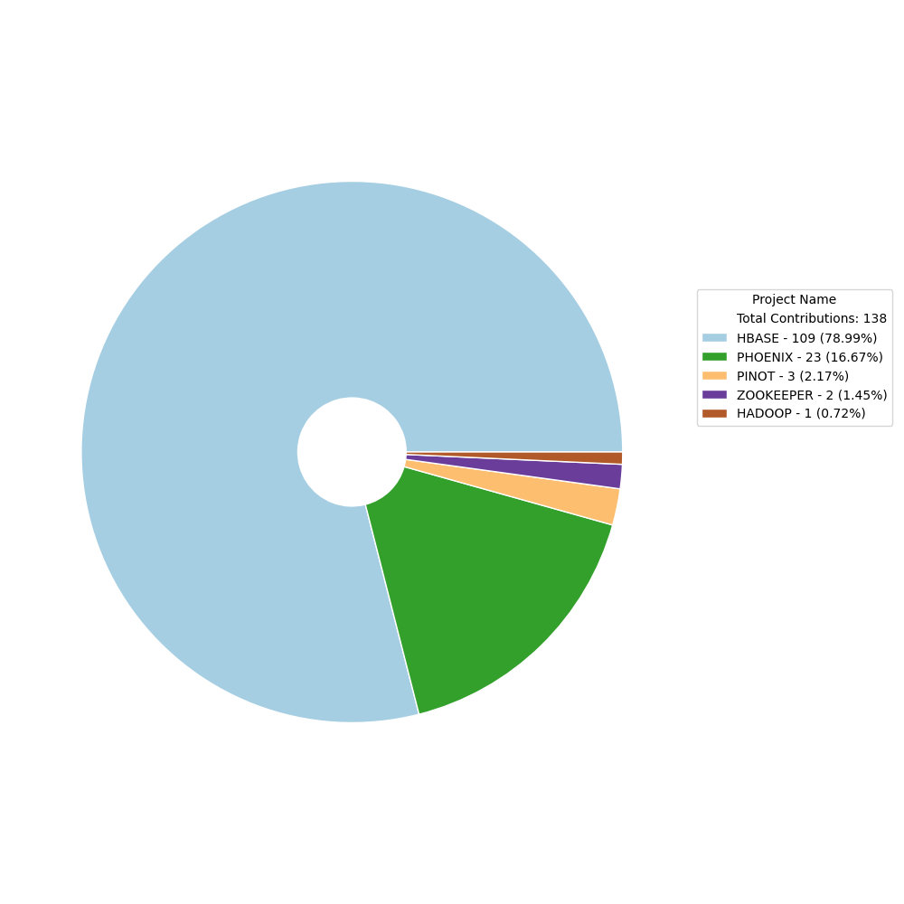
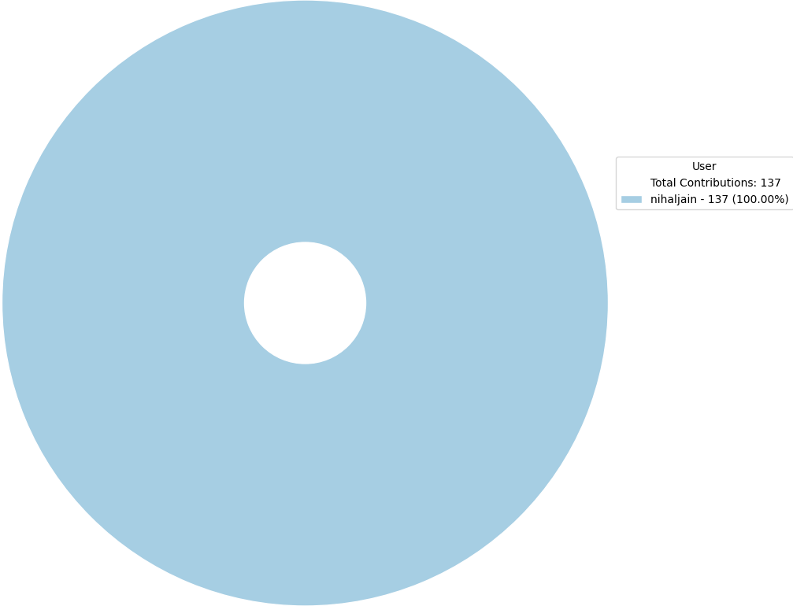

# OpenSource Contributions Report

Report auto-generated on: 2025-03-24 01:44:11

## Overall Summary

| Metric | Value |
|--------|-------|
| Total number of projects | 5 |
| Total number of repositories | 12 |
| Total number of contributions | 138 |
| Number of commits | 128 |
| Number of pull requests (Open) | 10 |

  
  

## Summary of Contributions by each project

| Project Key | Repositories | Users | Commits | Pull Requests (Open) | Overall Contribution |
|--------------|--------------|-------|---------|----------------------|----------------------|
| Apache HBase |  [apache/hbase](https://github.com/apache/hbase)  [apache/hbase-connectors](https://github.com/apache/hbase-connectors)  [apache/hbase-operator-tools](https://github.com/apache/hbase-operator-tools)  [apache/hbase-thirdparty](https://github.com/apache/hbase-thirdparty) |  [Nihal Jain](https://github.com/NihalJain) | 101 | 8 | 109 |
| Apache Phoenix |  [apache/phoenix](https://github.com/apache/phoenix)  [apache/phoenix-omid](https://github.com/apache/phoenix-omid)  [apache/phoenix-queryserver](https://github.com/apache/phoenix-queryserver)  [apache/phoenix-thirdparty](https://github.com/apache/phoenix-thirdparty) |  [Nihal Jain](https://github.com/NihalJain) | 21 | 2 | 23 |
| Apache Pinot |  [apache/pinot](https://github.com/apache/pinot)  [pinot-contrib/pinot-docs](https://github.com/pinot-contrib/pinot-docs) |  [Nihal Jain](https://github.com/NihalJain) | 3 | 0 | 3 |
| Apache Zookeeper |  [apache/zookeeper](https://github.com/apache/zookeeper) |  [Nihal Jain](https://github.com/NihalJain) | 2 | 0 | 2 |
| Apache Hadoop |  [apache/hadoop](https://github.com/apache/hadoop) |  [Nihal Jain](https://github.com/NihalJain) | 1 | 0 | 1 |

## Summary of Contributions by each user

| User | Repositories | Commits | Pull Requests (Open) | Overall Contribution |
|------|--------------|---------|----------------------|----------------------|
|  [Nihal Jain](https://github.com/NihalJain) |  [apache/hadoop](https://github.com/apache/hadoop)  [apache/hbase](https://github.com/apache/hbase)  [apache/hbase-connectors](https://github.com/apache/hbase-connectors)  [apache/hbase-operator-tools](https://github.com/apache/hbase-operator-tools)  [apache/hbase-thirdparty](https://github.com/apache/hbase-thirdparty)  [apache/phoenix](https://github.com/apache/phoenix)  [apache/phoenix-omid](https://github.com/apache/phoenix-omid)  [apache/phoenix-queryserver](https://github.com/apache/phoenix-queryserver)  [apache/phoenix-thirdparty](https://github.com/apache/phoenix-thirdparty)  [apache/pinot](https://github.com/apache/pinot)  [apache/zookeeper](https://github.com/apache/zookeeper)  [pinot-contrib/pinot-docs](https://github.com/pinot-contrib/pinot-docs) | 128 | 10 | 138 |

## Detailed Contributions

| Project Key | Repository | User | Commits | Pull Requests (Open) | Overall Contribution |
|--------------|------------|------|---------|----------------------|----------------------|
| Apache HBase |  [apache/hbase](https://github.com/apache/hbase) |  [Nihal Jain](https://github.com/NihalJain) | 76 | 5 | 81 |
| Apache HBase |  [apache/hbase-connectors](https://github.com/apache/hbase-connectors) |  [Nihal Jain](https://github.com/NihalJain) | 7 | 1 | 8 |
| Apache HBase |  [apache/hbase-thirdparty](https://github.com/apache/hbase-thirdparty) |  [Nihal Jain](https://github.com/NihalJain) | 5 | 2 | 7 |
| Apache HBase |  [apache/hbase-operator-tools](https://github.com/apache/hbase-operator-tools) |  [Nihal Jain](https://github.com/NihalJain) | 13 | 0 | 13 |
| Apache Hadoop |  [apache/hadoop](https://github.com/apache/hadoop) |  [Nihal Jain](https://github.com/NihalJain) | 1 | 0 | 1 |
| Apache Phoenix |  [apache/phoenix](https://github.com/apache/phoenix) |  [Nihal Jain](https://github.com/NihalJain) | 5 | 2 | 7 |
| Apache Phoenix |  [apache/phoenix-omid](https://github.com/apache/phoenix-omid) |  [Nihal Jain](https://github.com/NihalJain) | 10 | 0 | 10 |
| Apache Phoenix |  [apache/phoenix-queryserver](https://github.com/apache/phoenix-queryserver) |  [Nihal Jain](https://github.com/NihalJain) | 5 | 0 | 5 |
| Apache Phoenix |  [apache/phoenix-thirdparty](https://github.com/apache/phoenix-thirdparty) |  [Nihal Jain](https://github.com/NihalJain) | 1 | 0 | 1 |
| Apache Pinot |  [pinot-contrib/pinot-docs](https://github.com/pinot-contrib/pinot-docs) |  [Nihal Jain](https://github.com/NihalJain) | 2 | 0 | 2 |
| Apache Pinot |  [apache/pinot](https://github.com/apache/pinot) |  [Nihal Jain](https://github.com/NihalJain) | 1 | 0 | 1 |
| Apache Zookeeper |  [apache/zookeeper](https://github.com/apache/zookeeper) |  [Nihal Jain](https://github.com/NihalJain) | 2 | 0 | 2 |
