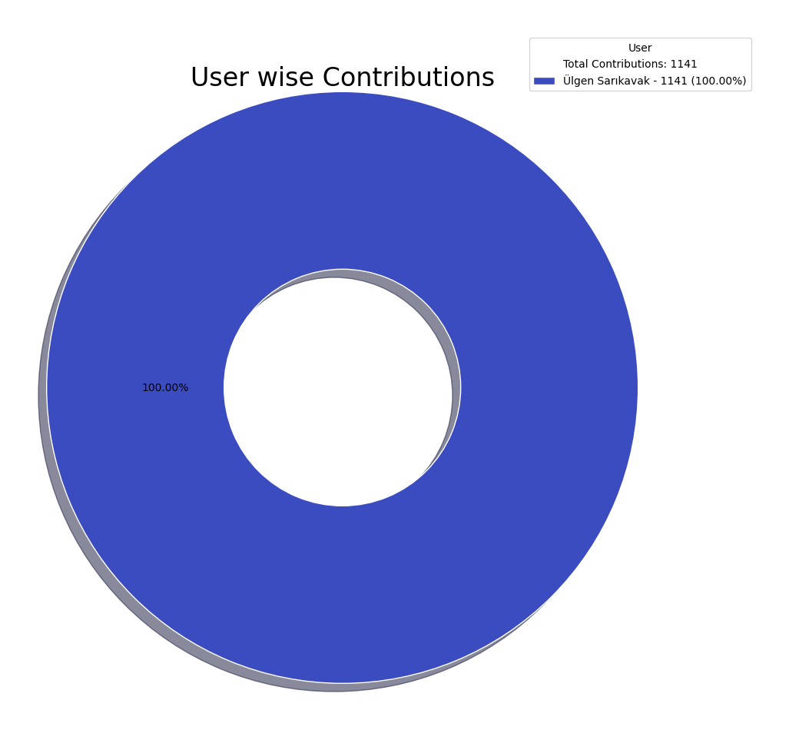

# GitHub Contributions Report

Report auto-generated on: 2025-03-18 01:40:15

## Summary of Contributions by each user

| User | Commits | Pull Requests (Open) | Overall Contribution |
|------|---------|----------------------|----------------------|
| nihaljain | 128 | 10 | 138 |

## Summary of Contributions by each project

| Project Name | Commits | Pull Requests (Open) | Overall Contribution |
|--------------|---------|----------------------|----------------------|
| HBASE | 101 | 8 | 109 |
| PHOENIX | 21 | 2 | 23 |
| PINOT | 3 | 0 | 3 |
| ZOOKEEPER | 2 | 0 | 2 |
| HADOOP | 1 | 0 | 1 |

## Detailed Contributions

| Project Name | Repository | User | Commits | Pull Requests (Open) | Overall Contribution |
|--------------|------------|------|---------|----------------------|----------------------|
| HBASE | apache/hbase | nihaljain | 76 | 5 | 81 |
| HBASE | apache/hbase-operator-tools | nihaljain | 13 | 0 | 13 |
| PHOENIX | apache/phoenix-omid | nihaljain | 10 | 0 | 10 |
| HBASE | apache/hbase-connectors | nihaljain | 7 | 1 | 8 |
| HBASE | apache/hbase-thirdparty | nihaljain | 5 | 2 | 7 |
| PHOENIX | apache/phoenix | nihaljain | 5 | 2 | 7 |
| PHOENIX | apache/phoenix-queryserver | nihaljain | 5 | 0 | 5 |
| ZOOKEEPER | apache/zookeeper | nihaljain | 2 | 0 | 2 |
| PINOT | pinot-contrib/pinot-docs | nihaljain | 2 | 0 | 2 |
| PHOENIX | apache/phoenix-thirdparty | nihaljain | 1 | 0 | 1 |
| HADOOP | apache/hadoop | nihaljain | 1 | 0 | 1 |
| PINOT | apache/pinot | nihaljain | 1 | 0 | 1 |
