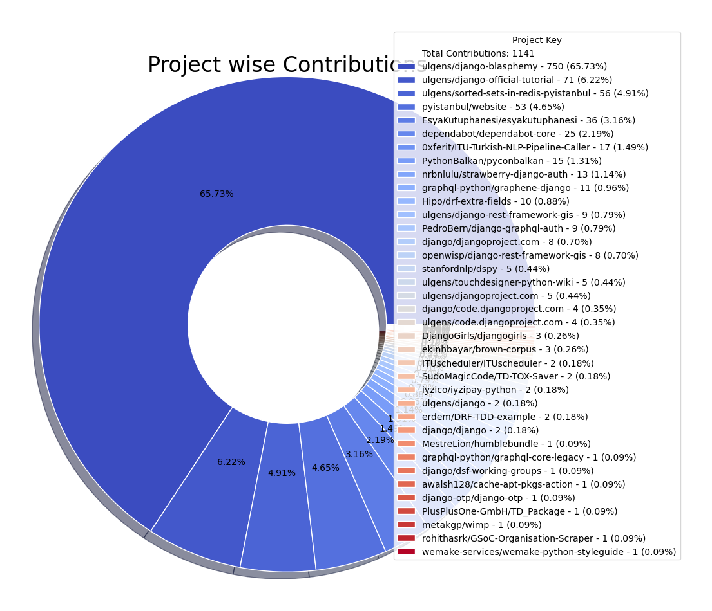

# OpenSource Contributions Report

Report auto-generated on: 2025-04-05 15:55:42

## Overall Summary

| Metric | Value |
|--------|-------|
| Total number of projects | 37 |
| Total number of repositories | 37 |
| Total number of contributions | 1141 |
| Number of commits | 1128 |
| Number of pull requests (Open) | 13 |

  
  

## Summary of Contributions by each project

| Project Key | Repositories | Users | Commits | Pull Requests (Open) | Overall Contribution |
|--------------|--------------|-------|---------|----------------------|----------------------|
| ulgens/django-blasphemy |  [ulgens/django-blasphemy](https://github.com/ulgens/django-blasphemy) |  [Ülgen Sarıkavak](https://github.com/ulgens) | 750 | 0 | 750 |
| ulgens/django-official-tutorial |  [ulgens/django-official-tutorial](https://github.com/ulgens/django-official-tutorial) |  [Ülgen Sarıkavak](https://github.com/ulgens) | 70 | 1 | 71 |
| ulgens/sorted-sets-in-redis-pyistanbul |  [ulgens/sorted-sets-in-redis-pyistanbul](https://github.com/ulgens/sorted-sets-in-redis-pyistanbul) |  [Ülgen Sarıkavak](https://github.com/ulgens) | 56 | 0 | 56 |
| pyistanbul/website |  [pyistanbul/website](https://github.com/pyistanbul/website) |  [Ülgen Sarıkavak](https://github.com/ulgens) | 53 | 0 | 53 |
| EsyaKutuphanesi/esyakutuphanesi |  [EsyaKutuphanesi/esyakutuphanesi](https://github.com/EsyaKutuphanesi/esyakutuphanesi) |  [Ülgen Sarıkavak](https://github.com/ulgens) | 36 | 0 | 36 |
| dependabot/dependabot-core |  [dependabot/dependabot-core](https://github.com/dependabot/dependabot-core) |  [Ülgen Sarıkavak](https://github.com/ulgens) | 25 | 0 | 25 |
| 0xferit/ITU-Turkish-NLP-Pipeline-Caller |  [0xferit/ITU-Turkish-NLP-Pipeline-Caller](https://github.com/0xferit/ITU-Turkish-NLP-Pipeline-Caller) |  [Ülgen Sarıkavak](https://github.com/ulgens) | 17 | 0 | 17 |
| PythonBalkan/pyconbalkan |  [PythonBalkan/pyconbalkan](https://github.com/PythonBalkan/pyconbalkan) |  [Ülgen Sarıkavak](https://github.com/ulgens) | 15 | 0 | 15 |
| nrbnlulu/strawberry-django-auth |  [nrbnlulu/strawberry-django-auth](https://github.com/nrbnlulu/strawberry-django-auth) |  [Ülgen Sarıkavak](https://github.com/ulgens) | 13 | 0 | 13 |
| graphql-python/graphene-django |  [graphql-python/graphene-django](https://github.com/graphql-python/graphene-django) |  [Ülgen Sarıkavak](https://github.com/ulgens) | 11 | 0 | 11 |
| Hipo/drf-extra-fields |  [Hipo/drf-extra-fields](https://github.com/Hipo/drf-extra-fields) |  [Ülgen Sarıkavak](https://github.com/ulgens) | 10 | 0 | 10 |
| ulgens/django-rest-framework-gis |  [ulgens/django-rest-framework-gis](https://github.com/ulgens/django-rest-framework-gis) |  [Ülgen Sarıkavak](https://github.com/ulgens) | 8 | 1 | 9 |
| PedroBern/django-graphql-auth |  [PedroBern/django-graphql-auth](https://github.com/PedroBern/django-graphql-auth) |  [Ülgen Sarıkavak](https://github.com/ulgens) | 9 | 0 | 9 |
| django/djangoproject.com |  [django/djangoproject.com](https://github.com/django/djangoproject.com) |  [Ülgen Sarıkavak](https://github.com/ulgens) | 6 | 2 | 8 |
| openwisp/django-rest-framework-gis |  [openwisp/django-rest-framework-gis](https://github.com/openwisp/django-rest-framework-gis) |  [Ülgen Sarıkavak](https://github.com/ulgens) | 8 | 0 | 8 |
| stanfordnlp/dspy |  [stanfordnlp/dspy](https://github.com/stanfordnlp/dspy) |  [Ülgen Sarıkavak](https://github.com/ulgens) | 1 | 4 | 5 |
| ulgens/touchdesigner-python-wiki |  [ulgens/touchdesigner-python-wiki](https://github.com/ulgens/touchdesigner-python-wiki) |  [Ülgen Sarıkavak](https://github.com/ulgens) | 4 | 1 | 5 |
| ulgens/djangoproject.com |  [ulgens/djangoproject.com](https://github.com/ulgens/djangoproject.com) |  [Ülgen Sarıkavak](https://github.com/ulgens) | 5 | 0 | 5 |
| django/code.djangoproject.com |  [django/code.djangoproject.com](https://github.com/django/code.djangoproject.com) |  [Ülgen Sarıkavak](https://github.com/ulgens) | 4 | 0 | 4 |
| ulgens/code.djangoproject.com |  [ulgens/code.djangoproject.com](https://github.com/ulgens/code.djangoproject.com) |  [Ülgen Sarıkavak](https://github.com/ulgens) | 4 | 0 | 4 |
| DjangoGirls/djangogirls |  [DjangoGirls/djangogirls](https://github.com/DjangoGirls/djangogirls) |  [Ülgen Sarıkavak](https://github.com/ulgens) | 3 | 0 | 3 |
| ekinhbayar/brown-corpus |  [ekinhbayar/brown-corpus](https://github.com/ekinhbayar/brown-corpus) |  [Ülgen Sarıkavak](https://github.com/ulgens) | 3 | 0 | 3 |
| ITUscheduler/ITUscheduler |  [ITUscheduler/ITUscheduler](https://github.com/ITUscheduler/ITUscheduler) |  [Ülgen Sarıkavak](https://github.com/ulgens) | 2 | 0 | 2 |
| SudoMagicCode/TD-TOX-Saver |  [SudoMagicCode/TD-TOX-Saver](https://github.com/SudoMagicCode/TD-TOX-Saver) |  [Ülgen Sarıkavak](https://github.com/ulgens) | 2 | 0 | 2 |
| iyzico/iyzipay-python |  [iyzico/iyzipay-python](https://github.com/iyzico/iyzipay-python) |  [Ülgen Sarıkavak](https://github.com/ulgens) | 2 | 0 | 2 |
| ulgens/django |  [ulgens/django](https://github.com/ulgens/django) |  [Ülgen Sarıkavak](https://github.com/ulgens) | 1 | 1 | 2 |
| erdem/DRF-TDD-example |  [erdem/DRF-TDD-example](https://github.com/erdem/DRF-TDD-example) |  [Ülgen Sarıkavak](https://github.com/ulgens) | 2 | 0 | 2 |
| django/django |  [django/django](https://github.com/django/django) |  [Ülgen Sarıkavak](https://github.com/ulgens) | 1 | 1 | 2 |
| MestreLion/humblebundle |  [MestreLion/humblebundle](https://github.com/MestreLion/humblebundle) |  [Ülgen Sarıkavak](https://github.com/ulgens) | 1 | 0 | 1 |
| graphql-python/graphql-core-legacy |  [graphql-python/graphql-core-legacy](https://github.com/graphql-python/graphql-core-legacy) |  [Ülgen Sarıkavak](https://github.com/ulgens) | 0 | 1 | 1 |
| django/dsf-working-groups |  [django/dsf-working-groups](https://github.com/django/dsf-working-groups) |  [Ülgen Sarıkavak](https://github.com/ulgens) | 0 | 1 | 1 |
| awalsh128/cache-apt-pkgs-action |  [awalsh128/cache-apt-pkgs-action](https://github.com/awalsh128/cache-apt-pkgs-action) |  [Ülgen Sarıkavak](https://github.com/ulgens) | 1 | 0 | 1 |
| django-otp/django-otp |  [django-otp/django-otp](https://github.com/django-otp/django-otp) |  [Ülgen Sarıkavak](https://github.com/ulgens) | 1 | 0 | 1 |
| PlusPlusOne-GmbH/TD_Package |  [PlusPlusOne-GmbH/TD_Package](https://github.com/PlusPlusOne-GmbH/TD_Package) |  [Ülgen Sarıkavak](https://github.com/ulgens) | 1 | 0 | 1 |
| metakgp/wimp |  [metakgp/wimp](https://github.com/metakgp/wimp) |  [Ülgen Sarıkavak](https://github.com/ulgens) | 1 | 0 | 1 |
| rohithasrk/GSoC-Organisation-Scraper |  [rohithasrk/GSoC-Organisation-Scraper](https://github.com/rohithasrk/GSoC-Organisation-Scraper) |  [Ülgen Sarıkavak](https://github.com/ulgens) | 1 | 0 | 1 |
| wemake-services/wemake-python-styleguide |  [wemake-services/wemake-python-styleguide](https://github.com/wemake-services/wemake-python-styleguide) |  [Ülgen Sarıkavak](https://github.com/ulgens) | 1 | 0 | 1 |

## Summary of Contributions by each user

| User | Repositories | Commits | Pull Requests (Open) | Overall Contribution |
|------|--------------|---------|----------------------|----------------------|
|  [Ülgen Sarıkavak](https://github.com/ulgens) |  [0xferit/ITU-Turkish-NLP-Pipeline-Caller](https://github.com/0xferit/ITU-Turkish-NLP-Pipeline-Caller)  [DjangoGirls/djangogirls](https://github.com/DjangoGirls/djangogirls)  [EsyaKutuphanesi/esyakutuphanesi](https://github.com/EsyaKutuphanesi/esyakutuphanesi)  [Hipo/drf-extra-fields](https://github.com/Hipo/drf-extra-fields)  [ITUscheduler/ITUscheduler](https://github.com/ITUscheduler/ITUscheduler)  [MestreLion/humblebundle](https://github.com/MestreLion/humblebundle)  [PedroBern/django-graphql-auth](https://github.com/PedroBern/django-graphql-auth)  [PlusPlusOne-GmbH/TD_Package](https://github.com/PlusPlusOne-GmbH/TD_Package)  [PythonBalkan/pyconbalkan](https://github.com/PythonBalkan/pyconbalkan)  [SudoMagicCode/TD-TOX-Saver](https://github.com/SudoMagicCode/TD-TOX-Saver)  [awalsh128/cache-apt-pkgs-action](https://github.com/awalsh128/cache-apt-pkgs-action)  [dependabot/dependabot-core](https://github.com/dependabot/dependabot-core)  [django-otp/django-otp](https://github.com/django-otp/django-otp)  [django/code.djangoproject.com](https://github.com/django/code.djangoproject.com)  [django/django](https://github.com/django/django)  [django/djangoproject.com](https://github.com/django/djangoproject.com)  [django/dsf-working-groups](https://github.com/django/dsf-working-groups)  [ekinhbayar/brown-corpus](https://github.com/ekinhbayar/brown-corpus)  [erdem/DRF-TDD-example](https://github.com/erdem/DRF-TDD-example)  [graphql-python/graphene-django](https://github.com/graphql-python/graphene-django)  [graphql-python/graphql-core-legacy](https://github.com/graphql-python/graphql-core-legacy)  [iyzico/iyzipay-python](https://github.com/iyzico/iyzipay-python)  [metakgp/wimp](https://github.com/metakgp/wimp)  [nrbnlulu/strawberry-django-auth](https://github.com/nrbnlulu/strawberry-django-auth)  [openwisp/django-rest-framework-gis](https://github.com/openwisp/django-rest-framework-gis)  [pyistanbul/website](https://github.com/pyistanbul/website)  [rohithasrk/GSoC-Organisation-Scraper](https://github.com/rohithasrk/GSoC-Organisation-Scraper)  [stanfordnlp/dspy](https://github.com/stanfordnlp/dspy)  [ulgens/code.djangoproject.com](https://github.com/ulgens/code.djangoproject.com)  [ulgens/django](https://github.com/ulgens/django)  [ulgens/django-blasphemy](https://github.com/ulgens/django-blasphemy)  [ulgens/django-official-tutorial](https://github.com/ulgens/django-official-tutorial)  [ulgens/django-rest-framework-gis](https://github.com/ulgens/django-rest-framework-gis)  [ulgens/djangoproject.com](https://github.com/ulgens/djangoproject.com)  [ulgens/sorted-sets-in-redis-pyistanbul](https://github.com/ulgens/sorted-sets-in-redis-pyistanbul)  [ulgens/touchdesigner-python-wiki](https://github.com/ulgens/touchdesigner-python-wiki)  [wemake-services/wemake-python-styleguide](https://github.com/wemake-services/wemake-python-styleguide) | 1128 | 13 | 1141 |

## Detailed Contributions

| Project Key | Repository | User | Commits | Pull Requests (Open) | Overall Contribution |
|--------------|------------|------|---------|----------------------|----------------------|
| MestreLion/humblebundle |  [MestreLion/humblebundle](https://github.com/MestreLion/humblebundle) |  [Ülgen Sarıkavak](https://github.com/ulgens) | 1 | 0 | 1 |
| django/code.djangoproject.com |  [django/code.djangoproject.com](https://github.com/django/code.djangoproject.com) |  [Ülgen Sarıkavak](https://github.com/ulgens) | 4 | 0 | 4 |
| django/dsf-working-groups |  [django/dsf-working-groups](https://github.com/django/dsf-working-groups) |  [Ülgen Sarıkavak](https://github.com/ulgens) | 0 | 1 | 1 |
| ulgens/touchdesigner-python-wiki |  [ulgens/touchdesigner-python-wiki](https://github.com/ulgens/touchdesigner-python-wiki) |  [Ülgen Sarıkavak](https://github.com/ulgens) | 4 | 1 | 5 |
| ulgens/django-blasphemy |  [ulgens/django-blasphemy](https://github.com/ulgens/django-blasphemy) |  [Ülgen Sarıkavak](https://github.com/ulgens) | 750 | 0 | 750 |
| iyzico/iyzipay-python |  [iyzico/iyzipay-python](https://github.com/iyzico/iyzipay-python) |  [Ülgen Sarıkavak](https://github.com/ulgens) | 2 | 0 | 2 |
| 0xferit/ITU-Turkish-NLP-Pipeline-Caller |  [0xferit/ITU-Turkish-NLP-Pipeline-Caller](https://github.com/0xferit/ITU-Turkish-NLP-Pipeline-Caller) |  [Ülgen Sarıkavak](https://github.com/ulgens) | 17 | 0 | 17 |
| django/django |  [django/django](https://github.com/django/django) |  [Ülgen Sarıkavak](https://github.com/ulgens) | 1 | 1 | 2 |
| erdem/DRF-TDD-example |  [erdem/DRF-TDD-example](https://github.com/erdem/DRF-TDD-example) |  [Ülgen Sarıkavak](https://github.com/ulgens) | 2 | 0 | 2 |
| stanfordnlp/dspy |  [stanfordnlp/dspy](https://github.com/stanfordnlp/dspy) |  [Ülgen Sarıkavak](https://github.com/ulgens) | 1 | 4 | 5 |
| awalsh128/cache-apt-pkgs-action |  [awalsh128/cache-apt-pkgs-action](https://github.com/awalsh128/cache-apt-pkgs-action) |  [Ülgen Sarıkavak](https://github.com/ulgens) | 1 | 0 | 1 |
| openwisp/django-rest-framework-gis |  [openwisp/django-rest-framework-gis](https://github.com/openwisp/django-rest-framework-gis) |  [Ülgen Sarıkavak](https://github.com/ulgens) | 8 | 0 | 8 |
| metakgp/wimp |  [metakgp/wimp](https://github.com/metakgp/wimp) |  [Ülgen Sarıkavak](https://github.com/ulgens) | 1 | 0 | 1 |
| PlusPlusOne-GmbH/TD_Package |  [PlusPlusOne-GmbH/TD_Package](https://github.com/PlusPlusOne-GmbH/TD_Package) |  [Ülgen Sarıkavak](https://github.com/ulgens) | 1 | 0 | 1 |
| Hipo/drf-extra-fields |  [Hipo/drf-extra-fields](https://github.com/Hipo/drf-extra-fields) |  [Ülgen Sarıkavak](https://github.com/ulgens) | 10 | 0 | 10 |
| PythonBalkan/pyconbalkan |  [PythonBalkan/pyconbalkan](https://github.com/PythonBalkan/pyconbalkan) |  [Ülgen Sarıkavak](https://github.com/ulgens) | 15 | 0 | 15 |
| graphql-python/graphql-core-legacy |  [graphql-python/graphql-core-legacy](https://github.com/graphql-python/graphql-core-legacy) |  [Ülgen Sarıkavak](https://github.com/ulgens) | 0 | 1 | 1 |
| ulgens/djangoproject.com |  [ulgens/djangoproject.com](https://github.com/ulgens/djangoproject.com) |  [Ülgen Sarıkavak](https://github.com/ulgens) | 5 | 0 | 5 |
| wemake-services/wemake-python-styleguide |  [wemake-services/wemake-python-styleguide](https://github.com/wemake-services/wemake-python-styleguide) |  [Ülgen Sarıkavak](https://github.com/ulgens) | 1 | 0 | 1 |
| ulgens/django-rest-framework-gis |  [ulgens/django-rest-framework-gis](https://github.com/ulgens/django-rest-framework-gis) |  [Ülgen Sarıkavak](https://github.com/ulgens) | 8 | 1 | 9 |
| pyistanbul/website |  [pyistanbul/website](https://github.com/pyistanbul/website) |  [Ülgen Sarıkavak](https://github.com/ulgens) | 53 | 0 | 53 |
| django-otp/django-otp |  [django-otp/django-otp](https://github.com/django-otp/django-otp) |  [Ülgen Sarıkavak](https://github.com/ulgens) | 1 | 0 | 1 |
| ekinhbayar/brown-corpus |  [ekinhbayar/brown-corpus](https://github.com/ekinhbayar/brown-corpus) |  [Ülgen Sarıkavak](https://github.com/ulgens) | 3 | 0 | 3 |
| django/djangoproject.com |  [django/djangoproject.com](https://github.com/django/djangoproject.com) |  [Ülgen Sarıkavak](https://github.com/ulgens) | 6 | 2 | 8 |
| ulgens/sorted-sets-in-redis-pyistanbul |  [ulgens/sorted-sets-in-redis-pyistanbul](https://github.com/ulgens/sorted-sets-in-redis-pyistanbul) |  [Ülgen Sarıkavak](https://github.com/ulgens) | 56 | 0 | 56 |
| ITUscheduler/ITUscheduler |  [ITUscheduler/ITUscheduler](https://github.com/ITUscheduler/ITUscheduler) |  [Ülgen Sarıkavak](https://github.com/ulgens) | 2 | 0 | 2 |
| rohithasrk/GSoC-Organisation-Scraper |  [rohithasrk/GSoC-Organisation-Scraper](https://github.com/rohithasrk/GSoC-Organisation-Scraper) |  [Ülgen Sarıkavak](https://github.com/ulgens) | 1 | 0 | 1 |
| ulgens/code.djangoproject.com |  [ulgens/code.djangoproject.com](https://github.com/ulgens/code.djangoproject.com) |  [Ülgen Sarıkavak](https://github.com/ulgens) | 4 | 0 | 4 |
| ulgens/django |  [ulgens/django](https://github.com/ulgens/django) |  [Ülgen Sarıkavak](https://github.com/ulgens) | 1 | 1 | 2 |
| ulgens/django-official-tutorial |  [ulgens/django-official-tutorial](https://github.com/ulgens/django-official-tutorial) |  [Ülgen Sarıkavak](https://github.com/ulgens) | 70 | 1 | 71 |
| DjangoGirls/djangogirls |  [DjangoGirls/djangogirls](https://github.com/DjangoGirls/djangogirls) |  [Ülgen Sarıkavak](https://github.com/ulgens) | 3 | 0 | 3 |
| graphql-python/graphene-django |  [graphql-python/graphene-django](https://github.com/graphql-python/graphene-django) |  [Ülgen Sarıkavak](https://github.com/ulgens) | 11 | 0 | 11 |
| SudoMagicCode/TD-TOX-Saver |  [SudoMagicCode/TD-TOX-Saver](https://github.com/SudoMagicCode/TD-TOX-Saver) |  [Ülgen Sarıkavak](https://github.com/ulgens) | 2 | 0 | 2 |
| nrbnlulu/strawberry-django-auth |  [nrbnlulu/strawberry-django-auth](https://github.com/nrbnlulu/strawberry-django-auth) |  [Ülgen Sarıkavak](https://github.com/ulgens) | 13 | 0 | 13 |
| EsyaKutuphanesi/esyakutuphanesi |  [EsyaKutuphanesi/esyakutuphanesi](https://github.com/EsyaKutuphanesi/esyakutuphanesi) |  [Ülgen Sarıkavak](https://github.com/ulgens) | 36 | 0 | 36 |
| dependabot/dependabot-core |  [dependabot/dependabot-core](https://github.com/dependabot/dependabot-core) |  [Ülgen Sarıkavak](https://github.com/ulgens) | 25 | 0 | 25 |
| PedroBern/django-graphql-auth |  [PedroBern/django-graphql-auth](https://github.com/PedroBern/django-graphql-auth) |  [Ülgen Sarıkavak](https://github.com/ulgens) | 9 | 0 | 9 |
